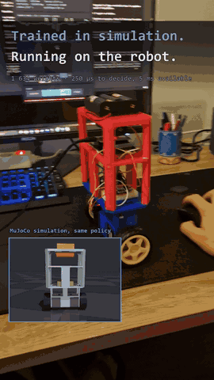
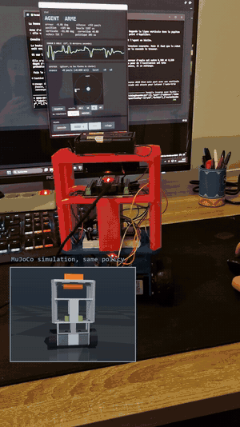

# Robot balancier

**Un robot à deux roues qui tient debout, d'abord avec un PID réglé à la main,
puis avec un réseau de neurones entraîné en simulation et exécuté sur l'ESP32.**

<table>
<tr>
<td></td>
<td></td>
</tr>
<tr>
<td align="center">robot réel, même politique qu'en simulation</td>
<td align="center">16 jalons d'entraînement, 9 M de pas</td>
</tr>
</table>

Vidéo complète (45 s) : voir la [dernière release](../../releases/latest).

> **In English.** A two-wheel self-balancing robot (ESP32, MPU-6050, two NEMA 17
> steppers, 3D-printed frame). I first stabilised it with a hand-tuned cascade
> PID, then rebuilt it in MuJoCo from its SolidWorks assembly and trained a PPO
> policy (1,634 weights) that now runs on the ESP32. The transfer only worked
> once the stepper motor was modelled as a magnetic spring and its 71 Hz
> resonance identified on the real robot, without dismantling anything. The
> documentation, the code and its comments are in French.

---

## Deux façons de commander le robot

Le même firmware embarque les deux, et on passe de l'une à l'autre en direct
(commande série `1` ou `2`, ou bouton du pupitre).

| | **double PID** (`1`) | **agent appris** (`2`) |
|---|---|---|
| origine | réglé à la main, pour apprendre l'automatique | entraîné par PPO dans MuJoCo |
| structure | boucle d'angle 200 Hz → accélération des roues, boucle de position 40 Hz qui déplace l'angle cible, auto-trim de la verticale | un réseau 15 → 32 → 32 → 2, 1 634 poids, qui remplace les deux boucles et décide à 100 Hz |
| en commun | lecture de l'IMU, intégration de la vitesse, génération des pas, sécurités | idem |

**En pratique :** armer le double PID une minute d'abord. Son auto-trim trouve
la vraie verticale, que l'agent reprend ensuite. L'agent n'a pas d'auto-trim.

Le double PID sert aussi de **témoin** : en simulation (`simulation/firmware.py`,
`08_agent.py --duel`) comme sur le robot, c'est lui qui dit si un mauvais
résultat vient de l'agent ou du matériel. Le 9 septembre, lancé avant l'agent,
il tenait douze fois moins bien que la veille : la dégradation venait donc du
robot (très probablement la batterie, un élément était mort), pas du
réentraînement.

---

## Ce qu'il y a dedans

```
hardware/     la mécanique : CAO SolidWorks, STL, nomenclature, câblage, montage réel
firmware/     le code ESP32 : cascade PID, politique apprise, sécurités, commandes série
tools/        le moniteur série (journal horodaté) et le pupitre de pilotage avec joystick
simulation/   MuJoCo, l'environnement Gymnasium, PPO, l'export C, les vidéos
docs/         le carnet de mise au point, le journal (pièges, décisions, résultats)
donnees/      les journaux série bruts du robot, source de chaque chiffre mesuré
```

| | |
|---|---|
| [`hardware/README.md`](hardware/README.md) | pièces, montage, **ce qui diffère de la CAO** (IMU déplacée) |
| [`hardware/cablage.md`](hardware/cablage.md) | brochage ESP32, A4988, MPU-6050, alimentation |
| [`firmware/README.md`](firmware/README.md) | architecture temps réel, commandes, télémétrie, téléversement |
| [`simulation/README.md`](simulation/README.md) | le modèle, l'entraînement, l'export vers l'ESP32 |
| [`docs/journal/PIEGES.md`](docs/journal/PIEGES.md) | les bugs rencontrés, leur coût, la règle qui en sort |
| [`docs/journal/RESULTATS.md`](docs/journal/RESULTATS.md) | tous les chiffres, avec la commande qui les produit |

---

## Résultats

**La simulation reproduit le robot réel.** Le même agent, jugé dans la
simulation et sur le matériel :

| | simulation | robot réel |
|---|---|---|
| erreur d'angle, écart-type | 1,743° | 1,572° |
| commande moteur, écart-type | 873 pas/s | 878 pas/s |

1 % d'écart sur la commande, environ 10 % sur l'inclinaison. La simulation n'a
jamais été ajustée sur cette observation : seuls la résonance du moteur et le
bruit des capteurs y ont été recalés, mesurés séparément.

**Réentraîné sur ce modèle fidèle**, le nouvel agent, en simulation :

| | ancien agent | **nouvel agent** | cascade PID |
|---|---|---|---|
| erreur d'angle, écart-type | 1,743° | **0,106°** | 0,185° |
| commande, écart-type | 873 pas/s | **47 pas/s** | 86 pas/s |
| dérive de position | 55 mm | 12 mm | 13 mm |
| survie à difficulté maximale | 25 % | **42 %** | 33 % |

Sur le robot, le nouvel agent a tenu 76 s avec 536 pas/s d'écart-type de
commande, contre 893 pour l'ancien. **La comparaison chiffrée avec la cascade
sur le matériel reste à faire.**

La cascade PID réglée à la main avait d'abord fait passer l'erreur d'angle de
0,293° à 0,064° (voir le [carnet](docs/carnet-du-balancier.html)). Elle n'a pas
été écrite pour être la meilleure, mais pour apprendre l'automatique.

---

## Démarrer

**Simulation** (Python 3.12, depuis `simulation/`) :

```
pip install -r requirements.txt
pip install torch --index-url https://download.pytorch.org/whl/cpu

python modele.py --etat                 chaque paramètre et sa provenance
python 01_regarder.py                   le robot dans le viewer
python 08_agent.py --agent agents/balancier_final.zip
python 08_agent.py --duel               agent contre cascade
python 07_ppo.py --actionneur couple --pas 9000000       réentraîner (~16 min)
python 11_export_c.py --agent agents/balancier_final.zip
python 12_valider_c.py                  le C doit égaler PyTorch
```

**Firmware** : ouvrir `firmware/robot_balancier/robot_balancier.ino` dans
l'IDE Arduino, carte *ESP32 Dev Module*, core esp32 3.3.

**Piloter le robot** (Windows) :

```
powershell -ExecutionPolicy Bypass -File tools\serial_monitor.ps1
python tools\pupitre.py
```

---

## Le parcours

| | |
|---|---|
| **août 2026** | châssis, électronique, cascade PID réglée à la main. Démonstration qu'une commande en vitesse ne peut pas stabiliser un pendule inversé, passage à une commande en accélération. Bug dans le pilote I2C d'Espressif remonté par `addr2line`. |
| **5 sept** | modèle MuJoCo reconstruit depuis l'assemblage SolidWorks, firmware porté en simulation comme témoin, premier agent PPO. |
| **9 sept** | politique exportée en C et validée contre PyTorch. Plantage de la carte résolu en isolant l'I2C dans une tâche dédiée. Identification du moteur en boucle fermée, par balayages et interspectres, sans démonter le robot : résonance à 71 Hz, pas 113. Réentraînement sur le moteur fidèle. |
| **10 sept** | direction (deux vitesses de roue indépendantes sur un seul timer), pupitre avec joystick, vidéo. |

## Ce qui reste ouvert

- mesurer la cascade et l'agent sur le matériel, dans les mêmes conditions ;
- régler le Vref des A4988, jamais mesuré ;
- refaire le pack batterie (un élément mort) et ajouter une mesure de tension ;
- la période du pendule suspendu, contre-épreuve du modèle ([`docs/MESURES.md`](docs/MESURES.md)).

---

**Matthieu Vinet**, élève ingénieur en robotique à Polytech Sorbonne ·
[matthieu-vinet.fr](https://matthieu-vinet.fr/)

Code écrit avec Claude Code comme assistant de programmation. Licence [MIT](LICENSE).
