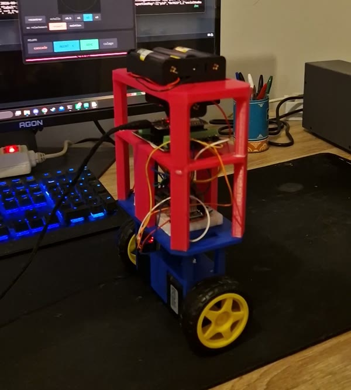
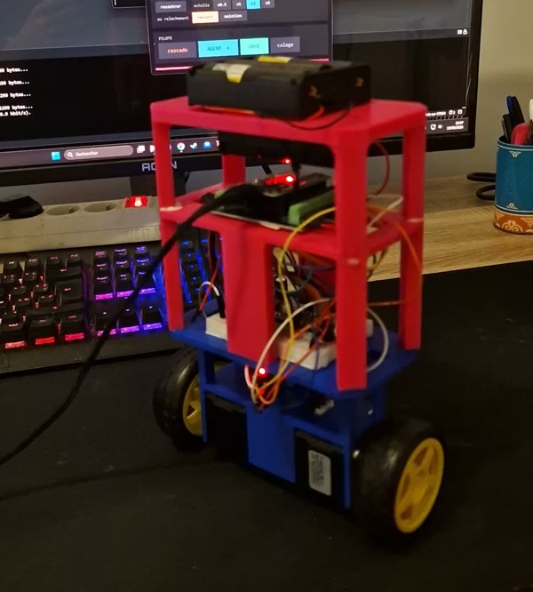
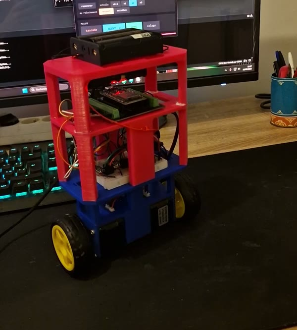

# Mécanique et matériel

[English](README.md) · **Français**

<table>
<tr>
<td></td>
<td></td>
<td></td>
</tr>
</table>

*Images extraites de la vidéo du 10 septembre 2026.*

Un pendule inversé sur deux roues. La pièce bleue du bas tient les deux
moteurs ; les trois étages rouges au-dessus portent la platine d'essai,
l'ESP32 et, tout en haut, le support des quatre batteries.

Le câblage est dans [`cablage.md`](cablage.md).

---

## Nomenclature

| composant | référence | qté | remarque |
|---|---|---|---|
| microcontrôleur | ESP32 WROOM-32D, carte de développement | 1 | |
| centrale inertielle | MPU-6050 | 1 | I2C, adresse 0x68 |
| drivers moteur | A4988 | 2 | micropas 1/8, soit 1 600 pas/tour (mesuré) |
| moteurs | NEMA 17 17HS3401S | 2 | |
| batteries | 18650 Li-ion 3,7 V LiitoKala | 4 | en série : 4S, 14,8 V nominal |
| convertisseur | abaisseur vers 5 V | 1 | alimente l'ESP32 par sa broche VIN |
| condensateur | 100 µF | 1 | sur VMOT |
| platine d'essai | breadboard | 1 | |
| roues | Ø 65 mm, 26 mm de large | 2 | |
| pièces imprimées | `piece1` à `piece4` | 4 | voir ci-dessous |
| inserts filetés | M2.5 | 2 | prévus pour l'emplacement d'origine de l'IMU, finalement pas utilisés |
| scotch double face | | | fixe l'ESP32, la platine, les batteries et l'IMU |

---

## Les pièces

| pièce | encombrement | volume imprimé |
|---|---|---|
| `piece1` | 113 × 42 × 47 mm | 92,8 cm³ |
| `piece2` | 143 × 75 × 45 mm | 65,2 cm³ |
| `piece3` | 143,6 × 75,6 × 80 mm | 118,1 cm³ |
| `piece4` | 143,7 × 75,7 × 63 mm | 103,5 cm³ |

Robot assemblé : 143,7 × 75,7 × 220 mm, 231,5 mm de haut roues comprises.
Étagères à +66, +141 et +199 mm au-dessus de l'axe des roues. Toutes ces cotes
sont lues dans l'assemblage par `simulation/modele.py`, pas mesurées au pied à
coulisse.

### Les fichiers

| dossier | contenu |
|---|---|
| `cao/solidworks/` | `Assemblage1.SLDASM` et les 5 pièces. **Version du 25 août 2026, la dernière.** |
| `cao/stl/` | les 4 pièces à imprimer. `piece2` à `piece4` sont les exports du 25 août (les anciens `v2`). |
| `cao/stl_assemblage/` | les 6 STL exportés dans le repère de l'assemblage, lus par la simulation |

### La retouche du 25 août

Comparaison des maillages avant et après : l'enveloppe extérieure des pièces
ne bouge pas. Un seul contour change, sur 5 mm de haut, en haut de chaque pièce.

| pièce | avant | après | par côté |
|---|---|---|---|
| `piece2` (tenon) | 107,90 × 36,90 mm | 107,70 × 36,70 mm | −0,10 mm |
| `piece3` | 130,74 × 66,90 mm | 130,46 × 66,70 mm | −0,14 / −0,10 mm |
| `piece4` | 130,73 × 62,73 mm | 130,45 × 62,45 mm | −0,14 mm |

C'est du jeu ajouté pour l'emboîtement des étages.

Les STL de `cao/stl_assemblage/` ont été exportés **avant** cette retouche
(vérifié par la géométrie : 0,01 mm d'écart avec l'ancienne `piece2`, 0,11 mm
avec la nouvelle). Sur la masse et l'inertie du modèle, 0,1 mm de paroi ne se
voit pas. Pour les aligner malgré tout : réexporter l'assemblage en STL, une
pièce par fichier, dans le repère de l'assemblage.

---

## Le montage réel diffère de la CAO

### L'IMU a été déplacée loin des moteurs

L'assemblage SolidWorks montre l'emplacement **prévu** de l'IMU, pas celui du
robot :

| | pièce | endroit | fixation |
|---|---|---|---|
| **prévu dans la CAO** | `piece1`, la pièce du bas | celle qui tient les deux moteurs | 2 inserts filetés M2.5 |
| **sur le robot** | `piece2`, la deuxième en partant du bas | sur le côté du pied central qui la porte | scotch double face |

Pourquoi : un moteur pas-à-pas avance par à-coups, 1 600 fois par tour. Collée
près de lui, l'IMU mesure ces vibrations en plus du mouvement du robot, et le
gyroscope les prend pour des rotations. Le terme dérivé du régulateur les
amplifie ensuite. Au début de la mise au point, le carnet relevait 3,48 °/s de
bruit sur le gyroscope.

Les deux **inserts M2.5** prévus pour la fixer sur la pièce des moteurs n'ont
donc finalement pas servi. Si on réimprime `piece1`, leurs logements peuvent
être ignorés.

**Orientation, à respecter si on la déplace encore.** Le firmware ne lit que
`AY`, `AZ` et `GX` : l'axe X du capteur doit rester parallèle à l'axe des roues.
Le capteur est monté couché, d'où une verticale lue vers −91,4° et non 0°. La
commande `Z` recale ce zéro, robot tenu droit.

### Fixations au scotch double face

L'**ESP32**, la **platine d'essai**, les **batteries** et l'**IMU** sont collés
au scotch double face, sans vis.

Deux conséquences :

- une pièce collée peut glisser après une chute. Si l'IMU a bougé, le point
  d'équilibre bouge avec elle : refaire le calage (`Z`) puis laisser le double
  PID tourner une minute pour que l'auto-trim retrouve la verticale ;
- pour l'IMU, un double face **épais, en mousse**, filtre en plus une partie des
  vibrations des moteurs.

---

## Points de vigilance

| | |
|---|---|
| **Vref des A4988** | jamais réglé. Il fixe le couple disponible. Procédure : `Vref = I × 8 × Rshunt`, voir le [carnet](../docs/carnet-du-balancier.html). |
| **ENABLE** | non câblé : les moteurs restent alimentés et chauffent même à l'arrêt. |
| **Tension batterie** | aucune mesure. Un élément est mort sans prévenir le 9 septembre 2026. Un pont diviseur vers une entrée analogique réglerait ça. |
| **USB et 5 V** | ne jamais alimenter l'ESP32 par l'USB et par le convertisseur en même temps. Garder les masses communes, débrancher le fil 5 V. |
| **Historique** | un premier ESP32 a été détruit par du 12 V sur sa broche 3V3. Les drivers et l'IMU ont été changés, pas le convertisseur. |
