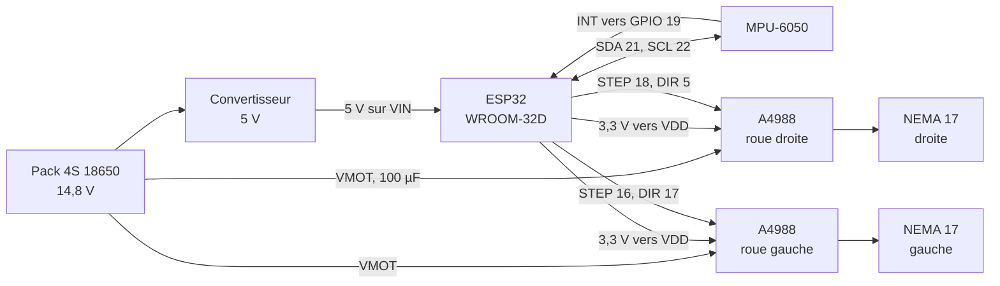

# Câblage

Toutes les masses sont communes.

Le convertisseur abaisse la tension du pack à 5 V et entre sur la broche
**VIN** de l'ESP32, dont le régulateur produit le 3,3 V qui alimente aussi
l'IMU et la logique des drivers.

---

## ESP32

Brochage lu dans `firmware/robot_balancier/robot_balancier.ino`.

| signal | GPIO | remarque |
|---|---|---|
| STEP moteur 1, **roue droite** | 18 | |
| DIR moteur 1 | 5 | |
| STEP moteur 2, **roue gauche** | 16 | |
| DIR moteur 2 | 17 | |
| INT du MPU-6050 | 19 | cadence la boucle à 200 Hz |
| SDA | 21 | I2C à **100 kHz** : 400 kHz s'est révélé inutilisable avec ce câblage |
| SCL | 22 | |

## MPU-6050

| broche | connexion |
|---|---|
| VCC | 3,3 V |
| GND | masse |
| SDA, SCL | GPIO 21, 22 |
| INT | GPIO 19 |
| AD0 | masse, d'où l'adresse 0x68 |

## A4988, identiques pour les deux roues

| broche | connexion | conséquence |
|---|---|---|
| VMOT | batterie, 14,8 V | condensateur de 100 µF au plus près |
| VDD | 3,3 V de l'ESP32 | **ne pas passer au 5 V** : le seuil logique haut deviendrait 3,5 V, au-dessus de ce que sort l'ESP32 |
| MS1, MS2 | 3,3 V | micropas 1/8 |
| MS3 | non connectée | tirée à la masse en interne par l'A4988 |
| RESET | ponté sur SLEEP | sort le driver de veille |
| ENABLE | non connecté | drivers toujours actifs |
| 1A, 1B | fils noir et vert | bobine 1 |
| 2A, 2B | fils rouge et bleu | bobine 2 |

**Le micropas.** 1 600 pas par tour ont été **mesurés** sur le robot le
9 septembre 2026, soit du 1/8 de pas. Sur l'A4988,
le 1/8 correspond à MS1 et MS2 au niveau haut et MS3 au niveau bas : toutes les
broches MS ne sont donc pas câblées. Le carnet d'origine notait les trois au
3,3 V, ce qui aurait donné du 1/16 et 3 200 pas par tour. La mesure l'a
contredit, et le montage confirme le 1/8.

Une bobine du moteur droit est inversée au câblage, d'où `INVERT_M1` et
`INVERT_M2` laissés à `false` dans le code.

---

## Ce qui a été appris sur le câblage

Le taux d'échec I2C dépendait de la **position des fils** : il est passé de 0 à
1,6 lecture ratée par seconde le soir où le robot a simplement été posé sur un
support. Les moteurs sont les principaux émetteurs de bruit.

Ce qui a réglé le problème côté logiciel : la lecture I2C tourne dans une tâche
séparée, et une lecture ratée n'arrête plus les moteurs. Depuis, 0 échec au
repos.

Recommandations restées ouvertes, par coût croissant :

- torsader les deux fils de chaque bobine moteur, gratuit ;
- éloigner les fils I2C des câbles moteurs, les croiser à 90° si besoin ;
- 10 kΩ de rappel vers la masse sur chaque STEP (GPIO 18 et 16) : au démarrage
  de l'ESP32 les broches flottent, et chaque parasite devient un pas ;
- découpler le VDD de chaque driver, 100 nF et 10 µF au ras du composant.
