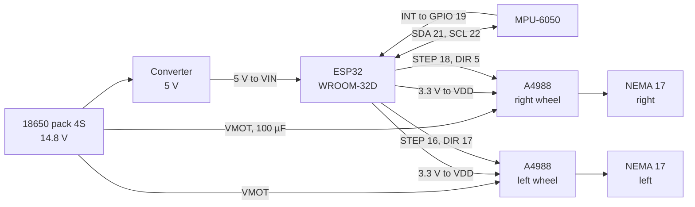

# Wiring

**English** · [Français](cablage.md)

All grounds are common.

The converter steps the pack voltage down to 5 V and feeds the ESP32's **VIN**
pin. The board's regulator then produces the 3.3 V that also powers the IMU and
the drivers' logic.

---

## ESP32

Pinout taken from `firmware/robot_balancier/robot_balancier.ino`.

| signal | GPIO | note |
|---|---|---|
| STEP motor 1, **right wheel** | 18 | |
| DIR motor 1 | 5 | |
| STEP motor 2, **left wheel** | 16 | |
| DIR motor 2 | 17 | |
| MPU-6050 INT | 19 | clocks the control loop at 200 Hz |
| SDA | 21 | I2C at **100 kHz**: 400 kHz proved unusable with this wiring |
| SCL | 22 | |

## MPU-6050

| pin | connection |
|---|---|
| VCC | 3.3 V |
| GND | ground |
| SDA, SCL | GPIO 21, 22 |
| INT | GPIO 19 |
| AD0 | ground, hence address 0x68 |

## A4988, identical for both wheels

| pin | connection | consequence |
|---|---|---|
| VMOT | battery, 14.8 V | 100 µF capacitor as close as possible |
| VDD | 3.3 V from the ESP32 | **do not move to 5 V**: the logic high threshold would become 3.5 V, above what the ESP32 outputs |
| MS1, MS2 | 3.3 V | 1/8 microstepping |
| MS3 | not connected | pulled to ground internally by the A4988 |
| RESET | bridged to SLEEP | keeps the driver awake |
| ENABLE | not connected | drivers always active |
| 1A, 1B | black and green wires | coil 1 |
| 2A, 2B | red and blue wires | coil 2 |

**Microstepping.** 1,600 steps per revolution were **measured** on the robot on
9 September 2026, i.e. 1/8 step. On the A4988, 1/8 means MS1 and MS2 high and
MS3 low, so not all MS pins are wired. The original notebook listed all three
at 3.3 V, which would have given 1/16 and 3,200 steps per revolution. The
measurement contradicted it, and the actual wiring confirms 1/8.

One coil of the right motor is swapped in the wiring, which is why `INVERT_M1`
and `INVERT_M2` are left `false` in the code.

---

## What was learned about the wiring

The I2C failure rate depended on **where the wires lay**: it went from 0 to 1.6
failed reads per second the evening the robot was simply placed on a stand. The
motors are the main source of noise.

What fixed it on the software side: I2C reading runs in a separate task, and a
failed read no longer stops the motors. Since then, 0 failures at rest.

Recommendations still open, by increasing cost:

- twist the two wires of each motor coil, free;
- keep the I2C wires away from the motor cables, cross them at 90° if needed;
- a 10 kΩ pull-down on each STEP pin (GPIO 18 and 16): while the ESP32 boots the
  pins float, and every glitch becomes a step;
- decouple each driver's VDD, 100 nF and 10 µF right at the chip.
